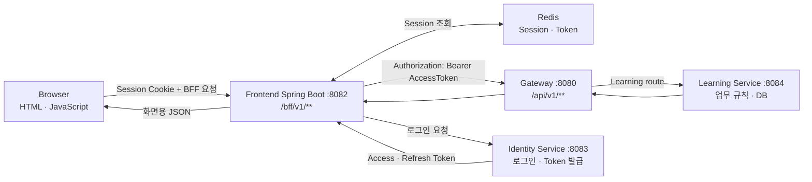
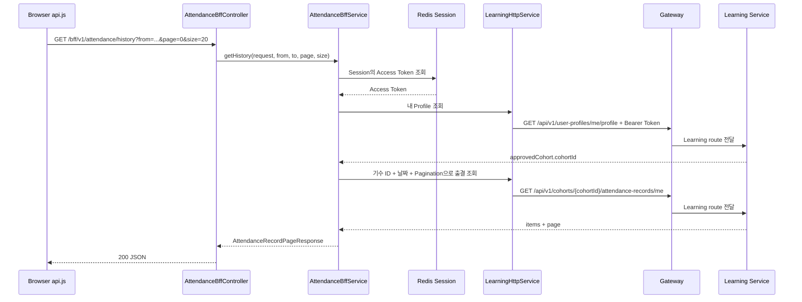

# 팀원 누구나 이해하는 Frontend BFF 실제 요청 흐름

> 상태: 현재 구현 설명
>
> 대상: Frontend·Backend·기획을 포함해 BFF를 처음 접하는 팀원
>
> 목적: 화면의 버튼 한 번이 BFF, Gateway, Learning Service를 거쳐 돌아오는 과정을 쉬운 말과 실제 코드 위치로 설명한다.

## 먼저 보는 30초 요약

사용자가 화면에서 출석 버튼을 누르면 다음 일이 일어난다.

```text
① 화면이 Frontend 서버에 “출석해 줘”라고 요청한다.
② Frontend 서버의 BFF가 로그인 정보와 사용자의 기수 ID를 붙인다.
③ Gateway가 요청을 Learning Service로 전달한다.
④ Learning Service가 출석 가능 여부를 판단하고 DB에 저장한다.
⑤ 결과가 반대 순서로 돌아와 화면에 표시된다.
```

팀원이 가장 먼저 구분할 것은 이것뿐이다.

| 우리가 흔히 부르는 말 | 정확히 가리키는 것 |
| --- | --- |
| 화면 또는 Browser | 사용자의 Chrome·Safari에서 실행되는 HTML·JavaScript |
| Frontend 서버 | 8082에서 실행되는 `view` Spring Boot 애플리케이션 |
| BFF | Frontend 서버 안에서 `/bff/v1/**` 요청을 처리하는 Java 코드 |
| Gateway | 요청받은 `/api/v1/**`를 담당 서비스로 보내는 서버 |
| Learning | 출결·기수·커뮤니티·캐릭터의 실제 규칙과 데이터를 가진 서버 |

**BFF는 화면 JavaScript도 아니고 Gateway도 아니다. Frontend Spring 서버 안에 있는
브라우저 전용 API 계층이다.**

## 1. BFF를 한 문장으로 설명하면

**BFF(Backend For Frontend)는 브라우저 전용 창구 역할을 하는 Frontend 서버 코드다.**

이 프로젝트에서 `frontend`라는 말은 두 부분을 모두 포함한다.

```text
Frontend
├── 브라우저에서 실행되는 HTML·JavaScript
└── 8082에서 실행되는 Spring Boot 서버  ← BFF가 있는 곳
```

BFF는 새로운 독립 서비스가 아니다. `view` 저장소의 Spring Boot 애플리케이션 안에 있는
`/bff/v1/**` Controller와 그 아래 Service·HTTP Client를 묶어서 부르는 이름이다.

### “Frontend”라는 말이 헷갈리는 이유

팀 대화에서 “프론트”라는 단어가 화면과 Spring 서버를 모두 가리킬 수 있기 때문이다.
이 문서에서는 아래처럼 구분한다.

- `Browser`: 사용자의 컴퓨터에서 실행되는 화면 코드
- `Frontend 서버`: `view` 저장소의 Spring Boot
- `BFF`: Frontend 서버 내부의 `/bff/v1/**` 처리 코드

예를 들어 “프론트가 Learning을 호출한다”는 말은 정확히는 **Browser가 BFF를 호출하고,
BFF가 Gateway를 통해 Learning을 호출한다**는 뜻이다.

## 2. 왜 브라우저가 Learning Service를 직접 호출하지 않는가

브라우저가 Learning Service나 Gateway를 직접 호출하면 다음 정보와 책임이 브라우저에
노출된다.

- Access Token
- Gateway와 내부 서비스 주소
- Learning Service의 내부 API 경로와 DTO
- 여러 API 응답을 조합하는 규칙
- 내부 오류를 사용자 화면용 오류로 바꾸는 규칙

BFF를 사용하면 브라우저는 다음 두 가지만 알면 된다.

1. 같은 주소의 `/bff/v1/**`를 호출한다.
2. 성공 응답을 화면에 표시하거나 공통 오류를 처리한다.

Access Token은 Frontend 서버의 Redis Session에만 보관된다. 브라우저에는 Token 대신
내용을 알 수 없는 HttpOnly Session Cookie만 전달된다.

## 3. 각 구성요소를 식당에 비유하면

| 구성요소 | 비유 | 실제 역할 |
| --- | --- | --- |
| Browser JavaScript | 손님 | 화면에 필요한 기능을 요청한다. |
| Frontend BFF | 주문받는 직원 | 브라우저 요청을 받고 Token·기수 정보를 보완한다. |
| Gateway | 주방 입구 | 요청을 올바른 내부 서비스로 전달하고 공통 보안을 적용한다. |
| Learning Service | 담당 요리사 | 출결·기수·커뮤니티 등 실제 업무 규칙과 DB 작업을 수행한다. |
| Identity Service | 회원 담당 직원 | 로그인하고 Access·Refresh Token을 발급한다. |
| Redis | 직원용 보관함 | Browser Session과 발급받은 Token을 서버 측에 보관한다. |

손님인 Browser가 주방인 Learning Service에 직접 들어가지 않는다. Frontend BFF에
요청하면 BFF가 로그인 정보를 꺼내 Gateway를 통해 Learning Service에 전달한다.

### 비유를 실제 출석 버튼에 대입하면

```text
손님: “출석 처리해 주세요.”
주문 직원(BFF): “로그인한 사람은 A이고 승인 기수는 1기입니다.”
주방 입구(Gateway): “출결 담당 주방으로 보내겠습니다.”
담당 요리사(Learning): “중복 출석인지 확인하고 저장했습니다.”
주문 직원(BFF): “화면에서 쓰는 응답으로 돌려드리겠습니다.”
손님: 출석 완료 화면을 본다.
```

## 4. 전체 구조



환경변수 기준 주소는 다음과 같다.

- Browser가 호출하는 주소: 현재 페이지와 같은 Origin의 `/bff/v1/**`
- BFF가 호출하는 Gateway 주소: `GATEWAY_SERVICE_BASE_URL`
- BFF가 로그인할 때 호출하는 Identity 주소: `IDENTITY_SERVICE_BASE_URL`

Browser JavaScript에는 `localhost:8080`, `localhost:8084` 같은 주소를 직접 작성하지 않는다.

## 5. 로그인할 때 일어나는 일

로그인은 기능 API 요청보다 먼저 한 번 수행된다.

```text
1. Browser가 POST /login으로 이메일과 비밀번호를 제출한다.
2. Frontend Spring Security가 Identity Service에 로그인을 요청한다.
3. Identity Service가 Access Token과 Refresh Token을 반환한다.
4. Frontend가 Token을 HttpSession에 넣는다.
5. Spring Session이 HttpSession을 Redis에 저장한다.
6. Browser에는 Session ID Cookie만 반환한다.
```

로그인 후 저장 위치는 다음과 같다.

```text
Browser
└── OMAGOTCHI_SESSION 같은 HttpOnly Session Cookie

Redis Session
├── 로그인 사용자 ID와 Role을 가진 SecurityContext
└── BrowserSessionTokenBundle
    ├── Access Token
    └── Refresh Token
```

따라서 Browser JavaScript는 Access Token을 읽거나 `Authorization` Header를 만들 필요가
없다. BFF가 Session에서 Access Token을 찾아 대신 전달한다.

## 6. 실제 예시 1: 출결 이력을 조회할 때

Browser 코드는 다음 API만 호출한다.

```javascript
window.OmagotchiApi.attendance.getHistory({
    from: "2026-08-01",
    to: "2026-08-31",
    page: 0,
    size: 20
});
```

이 호출은 실제로 다음 순서로 진행된다.



출결 BFF가 단순히 URL만 바꾸는 것이 아니라는 점이 중요하다.

- Browser는 자신의 `cohortId`를 보내지 않는다.
- `AttendanceBffService`가 현재 Session의 사용자 Profile을 먼저 조회한다.
- 승인 기수가 있으면 그 `cohortId`로 출결 API를 호출한다.
- 승인 기수가 없으면 `LEARNING_APPROVED_COHORT_REQUIRED` 오류를 반환한다.

즉, BFF가 화면에 필요한 사전 조회와 요청 조합을 담당한다.

## 7. 실제 예시 2: Presence처럼 단순 전달할 때

Presence는 추가 조합이 필요하지 않아 더 단순하다.

```text
api.js
  window.OmagotchiApi.presence.getLabPresence()
    ↓
GET /bff/v1/presence
    ↓
PresenceBffController
    ↓
LearningProxyBffService
  - Session에서 Access Token 조회
  - 공통 하류 오류 처리
    ↓
LearningHttpService.getPresence(...)
    ↓
Gateway GET /api/v1/cohorts/me/presence
    ↓
Learning Service
```

이 형태에서는 BFF 응답이 Learning 응답과 거의 같다. 그래도 Browser가 Token과 내부
경로를 몰라도 된다는 장점은 그대로 유지된다.

## 8. 실제 예시 3: POST·PATCH·DELETE와 CSRF

Session Cookie로 인증하는 Browser 요청은 CSRF 공격을 막아야 한다. `api.js`의 공통
`request()` 함수가 이 과정을 처리한다.

```text
1. GET /bff/v1/csrf로 CSRF Header 이름과 Token을 받는다.
2. POST·PUT·PATCH·DELETE 요청 Header에 CSRF Token을 넣는다.
3. credentials: "same-origin"으로 Session Cookie를 함께 보낸다.
4. Spring Security가 Session과 CSRF Token을 검증한다.
5. 검증을 통과한 요청만 BFF Controller에 도달한다.
```

예를 들어 출석 버튼은 다음 한 줄만 호출한다.

```javascript
await window.OmagotchiApi.attendance.checkIn();
```

`api.js`가 실제로 수행하는 요청은 다음과 같다.

```http
POST /bff/v1/attendance/check-in
Cookie: OMAGOTCHI_SESSION=...
X-CSRF-TOKEN: ...
```

BFF는 Session의 Access Token과 승인된 기수 ID를 찾아 Gateway 요청으로 바꾼다.

```http
POST /api/v1/cohorts/{cohortId}/attendance-records/check-in
Authorization: Bearer <Access Token>
```

두 요청의 인증 방식이 다르다는 점이 핵심이다.

| 구간 | 인증 정보 |
| --- | --- |
| Browser → BFF | Session Cookie + 변경 요청의 CSRF Token |
| BFF → Gateway → Learning | `Authorization: Bearer AccessToken` |

## 9. 첨부파일은 어떻게 전달되는가

커뮤니티 첨부파일 작성 시 Browser는 `FormData`를 사용한다.

```text
FormData
├── post: application/json Blob
└── attachments: File 0개 이상
```

`api.js`는 `FormData`에 `Content-Type`을 직접 지정하지 않는다. Browser가 multipart
boundary를 포함한 올바른 Header를 생성하게 하기 위해서다.

흐름은 다음과 같다.

```text
Browser FormData
→ POST /bff/v1/community/posts
→ CommunityBffController
→ LearningHttpService multipart 요청
→ Gateway
→ Learning Service 저장
```

다운로드는 상태를 변경하지 않는 GET 요청이다.

```text
GET /bff/v1/community/posts/{postId}/attachments/{attachmentId}
→ BFF가 Bearer Token을 붙여 Gateway로 전달
→ Learning Service가 권한과 게시글-첨부파일 소속을 검증
→ 파일 Resource와 Content-Disposition을 Browser에 반환
```

## 10. 응답과 오류는 어떻게 돌아오는가

성공 응답은 역순으로 돌아온다.

```text
Learning Service JSON
→ Gateway
→ BFF의 DTO 또는 JsonNode
→ Browser JSON
→ 화면 Rendering
```

BFF 응답 방식은 두 종류다.

| 방식 | 예 | 사용 이유 |
| --- | --- | --- |
| 거의 그대로 전달 | Presence, Community, Gamification | 현재 화면 계약과 Learning 응답이 동일하거나 단순함 |
| 조회·값을 조합해 새 응답 생성 | Profile, Attendance | 사용자 ID 보완, 승인 기수 조회처럼 화면용 처리가 필요함 |

Learning Service가 예상된 업무 오류를 반환하면 BFF가 공통 형태로 Browser에 전달한다.

```json
{
  "code": "LEARNING_APPROVED_COHORT_REQUIRED",
  "message": "승인된 기수에 가입한 뒤 이용할 수 있습니다.",
  "path": "/bff/v1/attendance/history",
  "requestId": null
}
```

`api.js`는 실패 응답을 `ApiRequestError`로 바꾼다. 화면 코드는 `status`, `code`,
`message`를 사용해 빈 상태·권한 부족·재시도 안내 등을 구분한다.

내부 Stack Trace나 허용되지 않은 하류 오류는 그대로 Browser에 노출하지 않는다.

## 11. 코드에서 어디를 보면 되는가

아래 경로는 모두 `view` Frontend 저장소를 기준으로 한다. 이 문서는 Learning Service와
`view` 저장소에 동일하게 보관하며, BFF 구현 자체는 `view` 저장소에 있다.

| 단계 | 파일·클래스 | 확인할 내용 |
| --- | --- | --- |
| Browser 공통 호출 | `static/js/api.js` | BFF 경로, Query, Body, CSRF, 오류 변환 |
| Browser 기능 화면 | `static/js/home/*.js`, `static/js/home.js` | 응답을 화면 상태로 Mapping |
| BFF 입구 | `*BffController` | Browser에 공개하는 `/bff/v1/**` 계약 |
| 화면용 처리 | `AttendanceBffService`, `ProfileBffService` | 여러 호출 조합과 DTO 보완 |
| 공통 대행 처리 | `LearningProxyBffService` | Session Token 조회와 공통 실행 경계 |
| Session 인증 변환 | `LearningSessionAuthorization` | Session Token을 Bearer Header로 변환 |
| Gateway HTTP 계약 | `LearningHttpService` | 실제 `/api/v1/**` Method·경로·DTO |
| 하류 오류 처리 | `LearningGatewayCallExecutor` | 연결 실패와 Learning 오류 변환 |
| JSON 오류 응답 | `ApiExceptionHandler` | Browser에 공개 가능한 오류 선별 |
| 보안 | `SecurityConfig`, `CsrfBffController` | 인증 필요 경로와 CSRF Token 제공 |

### 팀 역할별로 보는 수정 범위

| 담당 | 주로 수정하는 곳 | 반드시 확인할 상대 계약 |
| --- | --- | --- |
| 화면 담당 | `static/js/api.js`, `static/js/home/*.js` | BFF 경로, 화면에 필요한 응답 필드, 오류 `code` |
| Frontend 서버/BFF 담당 | `*BffController`, `*BffService`, `LearningHttpService`, Frontend DTO | Browser 계약과 Learning API 계약 양쪽 |
| Gateway 담당 | Learning route와 인증 Header 전달 설정 | BFF가 호출하는 `/api/v1/**`, Learning upstream |
| Learning 담당 | Learning Controller·Service·Repository·DTO | Gateway에 공개한 API 계약, JWT·기수·리소스 권한 |

화면 담당자는 Learning Controller를 직접 호출하지 않는다. Learning 담당자는 Browser의
DOM을 직접 수정하지 않는다. 두 계약을 연결하고 필요한 값을 조합하는 곳이 BFF다.

## 12. 새 API를 붙일 때의 작업 순서

기능 하나를 붙일 때 일반적으로 다음 순서로 작업한다.

1. Learning Service의 실제 Method·경로·요청·응답 계약을 확인한다.
2. `LearningHttpService`에 Gateway로 보낼 HTTP 계약을 추가한다.
3. 조합이 필요하면 기능별 BFF Service를 만들고, 단순 전달이면
   `LearningProxyBffService`를 사용한다.
4. `*BffController`에 Browser용 `/bff/v1/**` 경로를 만든다.
5. `api.js`에 `window.OmagotchiApi` 함수를 추가한다.
6. 화면 JavaScript가 그 함수의 응답을 Loading·Empty·Ready·Error 상태로 Mapping한다.
7. Controller·HTTP 계약 테스트와 실제 Frontend–Gateway–Service E2E를 확인한다.

요청 경로 세 개를 혼동하지 않아야 한다.

```text
화면 Page 경로:          /home
Browser용 BFF 경로:      /bff/v1/attendance/history
내부 Gateway API 경로:   /api/v1/cohorts/{cohortId}/attendance-records/me
```

### 팀끼리 API를 전달할 때 필요한 최소 정보

“API 만들었습니다”만 전달하면 연결하기 어렵다. 아래 내용을 함께 전달한다.

```text
기능명:
Method와 Learning 경로:
요청 Body 또는 Query:
성공 Status와 응답 예시:
빈 결과 형태:
예상 가능한 4xx code:
필요한 권한과 기수 조건:
```

BFF 담당자는 이 정보를 받아 Browser용 경로를 결정하고, 화면 담당자에게는 다음처럼
더 작은 계약으로 전달한다.

```text
호출 함수: OmagotchiApi.attendance.getHistory(...)
BFF 경로: GET /bff/v1/attendance/history
화면이 사용할 필드: items, page.number, page.totalPages
화면이 처리할 오류: LEARNING_APPROVED_COHORT_REQUIRED
```

## 13. 가장 자주 하는 오해

### “BFF는 Gateway와 같은 것인가?”

아니다. BFF는 **화면에 맞게 요청을 조합하는 Frontend 전용 서버 경계**이고, Gateway는
**내부 서비스로 요청을 Routing하는 공통 입구**다.

### “BFF를 쓰면 Learning Service의 권한 검사는 필요 없는가?”

아니다. BFF는 화면 편의를 담당한다. 최종 기수 소속·역할·리소스 접근 권한은 Learning
Service가 반드시 다시 검사한다.

### “JavaScript에서 Bearer Token을 넣어야 하는가?”

아니다. JavaScript는 Same-Origin Session Cookie만 자동으로 보낸다. Bearer Token은
BFF가 Redis Session에서 꺼내 내부 요청에만 사용한다.

### “`api.js`가 BFF인가?”

아니다. `api.js`는 BFF를 호출하는 Browser Adapter다. 실제 BFF는 Spring Boot의
`*BffController`, Application Service, `LearningHttpService` 쪽이다.

### “BFF Controller가 모든 업무 규칙을 가져야 하는가?”

아니다. Controller는 Browser 계약을 받고 결과를 반환하는 얇은 입구다. 화면용 조회
조합은 BFF Service가 담당하고, 출결·커뮤니티 같은 핵심 업무 규칙은 Learning Service가
담당한다.

## 14. 문제가 생겼을 때 확인 순서

Browser 개발자 도구의 Network에서 `/bff/v1/**` 요청 하나를 고른 뒤 아래 순서로 본다.

1. 요청 URL과 Method가 `api.js` 계약과 같은가?
2. `401`이면 로그인 Session Cookie가 있는가?
3. 상태 변경 요청의 `403`이면 CSRF Token을 전달했는가?
4. `404`이면 BFF 경로가 틀렸는가, 실제 업무 리소스가 없는가? 응답 `code`를 확인한다.
5. `409`이면 승인 기수 없음·중복 출석 같은 정상 업무 거절인가?
6. `502`이면 Gateway/Learning 응답 DTO가 BFF 계약과 다른가?
7. `503`이면 Redis, Gateway 또는 대상 Service가 실행 중인가?
8. Frontend 로그에서 BFF Controller 도달 여부와 하류 Status·`requestId`를 확인한다.

로컬 실행 시 기본 확인 순서는 Redis → Identity → Learning → Gateway → Frontend다.
Learning의 PostgreSQL은 팀 정책에 따라 로컬 DB에 직접 연결하지 않고 Testcontainers로
실행·검증한다.

## 15. 이것만 기억하면 된다

```text
Browser는 /bff/v1/**만 호출한다.
Browser는 Access Token과 내부 서비스 주소를 모른다.
BFF는 Frontend Spring Boot 안에 있다.
BFF는 Session Token과 화면에 필요한 값을 보완한다.
Gateway는 요청을 Learning Service로 전달한다.
최종 업무 규칙과 권한 검사는 Learning Service가 담당한다.
```

## 16. 회의에서 그대로 말할 수 있는 설명

> 저희 Browser는 Gateway나 Learning Service를 직접 호출하지 않습니다. 같은 Origin의
> `/bff/v1/**`만 호출합니다. BFF는 별도 서버가 아니라 `view` Spring Boot 안에 있고,
> Redis Session에서 Access Token을 꺼내 Bearer Header로 바꿉니다. 화면에 기수 ID가
> 없는 경우에는 BFF가 Profile을 먼저 조회해서 필요한 값을 보완합니다. 그 요청을
> Gateway가 Learning Service로 전달하고, 실제 업무 규칙과 최종 권한 검사는 Learning
> Service가 담당합니다. 성공이나 허용된 업무 오류가 다시 BFF를 통해 화면용 JSON으로
> 돌아오는 구조입니다.
